# 🔌 Integración WebSocket Realtime - Laboratorios Analiza

Esta guía detalla el protocolo, ciclo de vida y manejo de audio para la conexión en tiempo real con el asistente de IA.

**Servidor (Producción)**: `wss://web-production-6e86.up.railway.app`
**Ruta**: `/chat/realtime`

---

## 1. Diagrama de Flujo (Handshake & Audio)

```mermaid
sequenceDiagram
    participant Browser as Cliente (Browser)
    participant Server as Backend (Fastify)
    participant OpenAI as OpenAI Realtime API

    %% Handshake
    Browser->>Server: HTTP GET /chat/realtime (Upgrade: websocket)
    Server->>Server: Instancia ChatWebSocketProvider
    Server->>OpenAI: WebSocket Connect (WSS)
    OpenAI-->>Server: Connected (Session Created)
    Server-->>Browser: 101 Switching Protocols (Open)

    %% Audio Flow (User Speaking)
    Note over Browser: Micrófono (PCM16 24kHz)
    Browser->>Server: { event: "media", media: { payload: "BASE64..." } }
    Server->>OpenAI: input_audio_buffer.append (Base64)
    OpenAI-->>Server: response.audio.delta (Base64)
    Server->>Browser: { event: "media", media: { payload: "BASE64..." } }
    Note over Browser: Play Audio (PCM16)

    %% Text Flow (User Typing)
    Browser->>Server: { event: "text", text: "Hola" }
    Server->>OpenAI: conversation.item.create (Text)
    OpenAI-->>Server: response.text.delta
    Server->>Browser: { event: "text", text: "Hola, soy Sofía..." }
```



---

## 2. Eventos del Protocolo (JSON)

El intercambio de datos se realiza estrictamente mediante mensajes JSON.

### Cliente → Backend (Browser)

#### Evento: `media` (Audio del Usuario)
Envía fragmentos de audio en bruto (PCM16) codificados en Base64.
- **Frecuencia**: Streaming continuo mientras el usuario habla (chunks de ~100-500ms).
- **Formato Audio**: PCM 16-bit, 24kHz, Mono.
```json
{
  "event": "media",
  "media": {
    "payload": "UklGRi..."  // <--- Base64 del Buffer Int16
  }
}
```

#### Evento: `text` (Input de Texto)
Envía un mensaje de texto directo (como un chat tradicional).
```json
{
  "event": "text",
  "text": "Quiero agendar una cita para mañana"
}
```

---

### Backend → Cliente (Server)

#### Evento: `media` (Respuesta de Audio IA)
Recibe fragmentos de audio para reproducir. El cliente debe decodificar Base64 -> Int16 -> Float32 y enviarlo al AudioContext.
```json
{
  "event": "media",
  "media": {
    "payload": "UklGRi..." // <--- Base64 del Audio Delta
  }
}
```

#### Evento: `text` (Respuesta de Texto IA)
Streaming de texto (tokens) para ir mostrando la respuesta en pantalla.
```json
{
  "event": "text",
  "text": "Con "
}
```
*(Seguido por otro mensaje)*
```json
{
  "event": "text",
  "text": "gusto, "
}
```

#### Evento: `error`
Notifica problemas críticos (API Key, Conexión OpenAI).
```json
{
  "event": "error",
  "message": "OpenAI API Key Invalid",
  "code": 4001
}
```

---

## 3. Detalles de Implementación de Audio

Para que la voz funcione correctamente, el cliente (Frontend) debe procesar el audio de la siguiente manera:

### Grabación (Microphone)
1.  **Worklet**: Usar un `AudioWorklet` para capturar el buffer del micrófono.
2.  **Conversión**: Convertir de `Float32` (Web Audio API default) a `Int16` (PCM).
3.  **Encoding**: Convertir el buffer `Int16` a una cadena Base64.
4.  **Envío**: Mandar por WebSocket en el evento `media`.

### Reproducción (Speaker)
1.  **Decoding**: Recibir Base64 -> Convertir a `Int16Array`.
2.  **Normalización**: Convertir `Int16` (-32768 a 32767) a `Float32` (-1.0 a 1.0).
3.  **Buffer**: Crear un `AudioBuffer` y reproducirlo con `AudioContext`.

---

## 4. Diferencias con N8n / Webhooks Viejos
*   **NO** se usa HTTP POST para audio. Todo es WebSocket bidireccional.
*   **NO** se usa Multipart Form Data.
*   **Latencia**: Al ser streaming (Deltas), la latencia es <500ms, mucho menor que el modelo Request/Response anterior.
